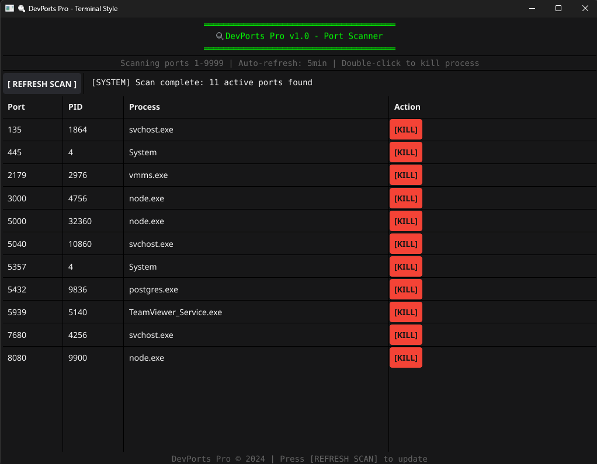

# DevPorts Pro 🔍

**Professional Port Scanner & Process Manager**

A modern, cross-platform port scanning tool with an intuitive GUI interface for developers, system administrators, and security professionals.


*Modern terminal-style interface showing active ports and running processes*

## ✨ Features

- **⚡ Lightning-Fast Scanning**: Scans 9999 ports in 5-15 seconds with 500 concurrent workers
- **🎯 Process Management**: View and terminate processes using specific ports
- **🖥️ Cross-Platform**: Native support for Windows, macOS, and Linux
- **🌐 Multiple Interfaces**: Desktop GUI, Web interface, and CLI options
- **🔄 Real-time Updates**: Auto-refresh every 5 minutes with manual refresh option
- **🎨 Modern UI**: Enhanced terminal aesthetics with improved colors and icons
- **🛡️ Safe Termination**: Multi-attempt verification with exponential backoff
- **✅ Robust Verification**: Confirms process termination with up to 5 retry attempts

## 🚀 Quick Start

### Desktop Application (Recommended)

1. Download the latest release for your platform
2. Run the executable
3. Click "REFRESH SCAN" to start scanning
4. Click "[KILL]" next to any process to terminate it safely

### Web Interface

1. Build and run with web interface flag
2. Open browser to `http://localhost:8080`
3. Access the same functionality through your web browser

## 📦 Installation & Building

### Prerequisites

- Go 1.19 or later
- Git (for development)

### Building from Source

#### Windows
```bash
# Clone the repository
git clone https://github.com/screamm/DevPorts-Pro.git
cd DevPorts-Pro

# Build desktop application
go mod tidy
go build -o devports-pro.exe

# Build web interface
go build -tags web -o devports-web.exe

# Build CLI version
go build -tags cli -o devports-cli.exe
```

#### macOS
```bash
# Clone the repository
git clone https://github.com/screamm/DevPorts-Pro.git
cd DevPorts-Pro

# Install dependencies
go mod tidy

# Build desktop application
go build -o devports-pro

# Build web interface
go build -tags web -o devports-web

# Build CLI version
go build -tags cli -o devports-cli

# Make executable
chmod +x devports-pro devports-web devports-cli
```

#### Linux
```bash
# Clone the repository
git clone https://github.com/screamm/DevPorts-Pro.git
cd DevPorts-Pro

# Install system dependencies (Ubuntu/Debian)
sudo apt-get update
sudo apt-get install -y build-essential libgl1-mesa-dev xorg-dev

# Install dependencies
go mod tidy

# Build desktop application
go build -o devports-pro

# Build web interface
go build -tags web -o devports-web

# Build CLI version
go build -tags cli -o devports-cli

# Make executable
chmod +x devports-pro devports-web devports-cli
```

### Cross-compilation

Build for all platforms from any OS:

```bash
# Windows
GOOS=windows GOARCH=amd64 go build -o devports-pro-windows.exe

# macOS
GOOS=darwin GOARCH=amd64 go build -o devports-pro-macos

# Linux
GOOS=linux GOARCH=amd64 go build -o devports-pro-linux
```

## 🖥️ Usage

### Desktop Application

Launch the application and you'll see:

- **Port Column**: Active port numbers (1-9999)
- **PID Column**: Process ID using each port
- **Process Column**: Name of the application/service
- **Action Column**: Kill button for process termination

### CLI Interface

```bash
# Scan ports and display results
./devports-cli scan

# Scan specific port range
./devports-cli scan --range 1000-5000

# Export results to JSON
./devports-cli scan --output json > ports.json

# Kill process by PID
./devports-cli kill --pid 1234
```

### Web Interface

```bash
# Start web server
./devports-web --port 8080

# Access via browser
open http://localhost:8080
```

## ⚙️ Configuration

### Environment Variables

- `DEVPORTS_SCAN_RANGE`: Set custom port range (default: 1-9999)
- `DEVPORTS_TIMEOUT`: Set connection timeout in milliseconds (default: 100ms)
- `DEVPORTS_REFRESH_INTERVAL`: Auto-refresh interval in minutes (default: 5)
- `DEVPORTS_WORKERS`: Number of concurrent scanning workers (default: 500)

### Command Line Options

```bash
Usage: devports-pro [OPTIONS]

Options:
  --range START-END    Port range to scan (default: 1-9999)
  --timeout DURATION   Connection timeout (default: 50ms)
  --no-gui            Run in CLI mode
  --web               Start web interface
  --port PORT         Web interface port (default: 8080)
  --help              Show this help message
```

## 🛡️ Security Features

- **Safe Process Termination**: Confirmation dialogs prevent accidental kills
- **Permission Handling**: Graceful handling of insufficient privileges
- **Process Verification**: Confirms process termination before reporting success
- **Error Recovery**: Robust error handling for system calls

## 🔧 Development

### Project Structure

```
DevPorts-Pro/
├── main.go              # Desktop GUI application
├── port_scanner.go      # Core port scanning logic
├── web_gui.go          # Web interface handler
├── desktop_simple.go   # Simplified desktop interface
├── go.mod              # Go module dependencies
├── go.sum              # Dependency checksums
└── README.md           # This file
```

### Dependencies

- **fyne.io/fyne/v2**: Cross-platform GUI framework
- **Standard Library**: No external dependencies for core functionality

### Contributing

1. Fork the repository
2. Create a feature branch: `git checkout -b feature-name`
3. Make your changes and add tests
4. Commit your changes: `git commit -am 'Add feature'`
5. Push to the branch: `git push origin feature-name`
6. Submit a pull request

## 📋 System Requirements

### Windows
- Windows 10 or later
- Administrator privileges (for process termination)

### macOS
- macOS 10.14 (Mojave) or later
- Xcode command line tools

### Linux
- Most modern distributions (Ubuntu 18.04+, Fedora 30+, etc.)
- X11 display server (for GUI)
- Root/sudo access (for process termination)

## ⚠️ Important Notes

- **Process Termination**: Killing system processes may cause instability
- **Permissions**: Some processes require elevated privileges to terminate
- **Network Security**: Tool shows only local processes and ports
- **Resource Usage**: Scanning large port ranges may impact system performance

## 📄 License

This project is licensed under the MIT License - see the [LICENSE](LICENSE) file for details.

## 🤝 Support

- **Issues**: Report bugs and request features on [GitHub Issues](https://github.com/screamm/DevPorts-Pro/issues)
- **Discussions**: Join conversations in [GitHub Discussions](https://github.com/screamm/DevPorts-Pro/discussions)
- **Security**: Report security vulnerabilities privately to the maintainers

## 📊 Changelog

### v1.0.1 (Performance & UX Update - 2025-09-30)
- ⚡ **100-500x faster scanning**: Concurrent worker pool with 500 goroutines
- 🎨 **Enhanced UI**: Modern cyan/green theme with improved icons (⚡✓✗⟳⏳)
- 🛡️ **Robust kill verification**: Multi-attempt with exponential backoff (5 retries)
- 📊 **Performance metrics**: Display scan duration in status
- ✅ **Better error handling**: Error dialogs and improved user feedback
- 🖥️ **Optimized layout**: 1100x800 window with better column widths
- ⏱️ **Faster response**: Reduced timeout and refresh delays

### v1.0.0 (Initial Release)
- Cross-platform port scanning (Windows, macOS, Linux)
- Desktop GUI with terminal aesthetics
- Process identification and termination
- Auto-refresh functionality
- Basic kill verification system
- Error handling and user feedback

---

**Made with ❤️ for developers and system administrators**